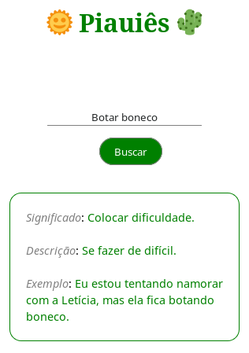

# 🌞 Piauiês 🌵

Aplicação que fornece os significados das gírias do estado do Piauí.

## Screenshot

## Dependencies

Certifique-se de ter o [Node.js](https://nodejs.org/en/) e o [npm](https://www.npmjs.com/) instalado.

Apenas a instalação do Node.js já é suficiente, pois o npm é instalado junto.

Para instalar as dependências, digite no terminal:

`$ npm install`

## Usage

Rode o aplicativo, executando o comando:

`$ npm start`

E para acessar a aplicação, abra seu navegador e acesse o endereço [http://localhost:3000](http://localhost:3000).

## License

This project is licensed under [MIT License](LICENSE).
